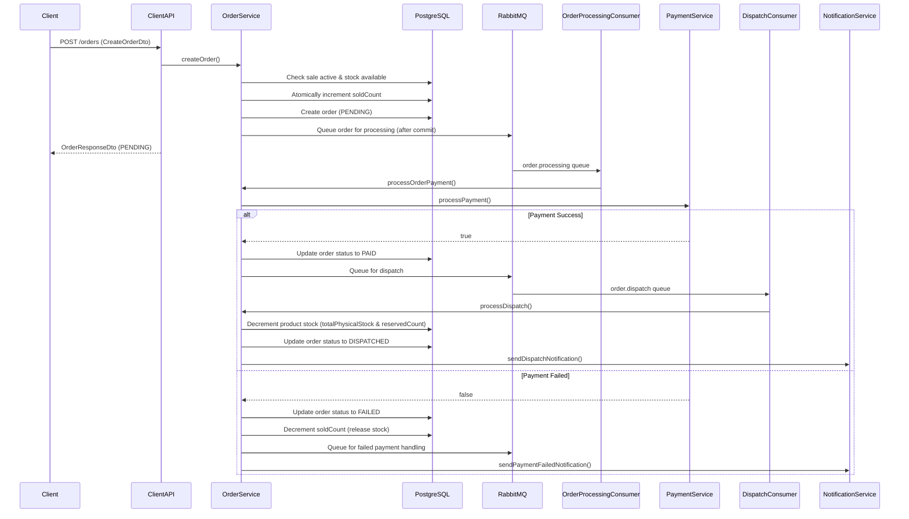
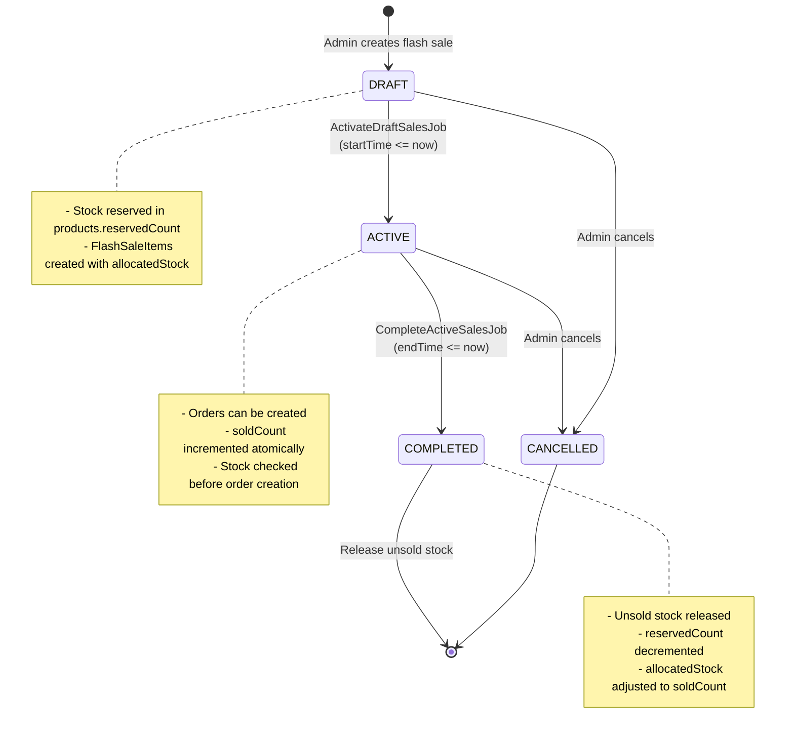

# Flash Sales Application - Architecture Diagram

```mermaid
graph TB
    %% External Actors
    Client[Client Applications]
    Admin[Admin Users]
    
    %% API Layer - Client APIs
    subgraph "API Layer - Client APIs (api-service profile)"
        ClientAPI[ClientRestApi<br/>/api/v1/clients]
        ClientAPI --> |GET /products/{id}| ProductsService
        ClientAPI --> |GET /sales/active| ActiveSalesService
        ClientAPI --> |GET /sales/draft/{days}| DraftSalesService
        ClientAPI --> |POST /orders| OrderService
        ClientAPI --> |POST /orders/{id}/refund| OrderService
    end
    
    %% API Layer - Admin APIs
    subgraph "API Layer - Admin APIs (admin-service profile)"
        AdminAPI[AdminRestApi<br/>/api/v1/admin]
        FlashSaleAdminAPI[FlashSaleAdminRestApi<br/>/api/v1/admin]
        ProductAPI[ProductRestApi<br/>/api/v1/products]
        
        FlashSaleAdminAPI --> |POST /flash_sale| FlashSalesService
        ProductAPI --> |CRUD operations| ProductsService
    end
    
    %% Service Layer
    subgraph "Service Layer"
        ProductsService[ProductsService<br/>- createProduct<br/>- getAllProducts<br/>- getProductById<br/>- updateProduct<br/>- deleteProduct]
        FlashSalesService[FlashSalesService<br/>- createFlashSale<br/>- activateDraftSales<br/>- completeActiveSales]
        ActiveSalesService[ActiveSalesService<br/>- getActiveSales<br/>@Cacheable activeSales]
        DraftSalesService[DraftSalesService<br/>- getDraftSalesWithinDays<br/>@Cacheable draftSales]
        OrderService[OrderService<br/>- createOrder<br/>- processOrderPayment<br/>- handleRefund<br/>- processFailedPayment<br/>- processDispatch]
        PaymentService[PaymentService<br/>- processPayment<br/>Mock payment processor]
        NotificationService[NotificationService<br/>- sendOrderConfirmation<br/>- sendPaymentFailedNotification<br/>- sendRefundNotification<br/>- sendDispatchNotification]
    end
    
    %% Scheduled Jobs
    subgraph "Scheduled Jobs (Quartz)"
        ActivateJob[ActivateDraftSalesJob<br/>Runs every 30s<br/>Activates DRAFT → ACTIVE]
        CompleteJob[CompleteActiveSalesJob<br/>Runs every 30s<br/>Completes ACTIVE → COMPLETED]
        
        ActivateJob --> |calls| FlashSalesService
        CompleteJob --> |calls| FlashSalesService
    end
    
    %% Message Queue Consumers
    subgraph "Message Queue Consumers (RabbitMQ)"
        OrderProcessingConsumer[OrderProcessingConsumer<br/>order.processing queue]
        DispatchConsumer[DispatchConsumer<br/>order.dispatch queue]
        FailedPaymentConsumer[FailedPaymentConsumer<br/>order.payment.failed queue]
        RefundConsumer[RefundConsumer<br/>order.refund queue]
        
        OrderProcessingConsumer --> |processOrderPayment| OrderService
        DispatchConsumer --> |processDispatch| OrderService
        FailedPaymentConsumer --> |processFailedPayment| OrderService
        RefundConsumer --> |sendRefundNotification| NotificationService
    end
    
    %% Message Queue Infrastructure
    subgraph "RabbitMQ Message Broker"
        OrderExchange[order.exchange<br/>Direct Exchange]
        ProcessingQueue[order.processing<br/>Queue]
        DispatchQueue[order.dispatch<br/>Queue]
        PaymentFailedQueue[order.payment.failed<br/>Queue]
        RefundQueue[order.refund<br/>Queue]
        
        OrderExchange --> |routing: order.processing| ProcessingQueue
        OrderExchange --> |routing: order.dispatch| DispatchQueue
        OrderExchange --> |routing: order.payment.failed| PaymentFailedQueue
        OrderExchange --> |routing: order.refund| RefundQueue
    end
    
    %% Repository Layer
    subgraph "Repository Layer (JPA)"
        ProductRepo[ProductRepository]
        FlashSaleRepo[FlashSaleRepository]
        FlashSaleItemRepo[FlashSaleItemRepository]
        OrderRepo[OrderRepository]
        RemainingActiveStockRepo[RemainingActiveStockRepository<br/>Reads from DB View]
    end
    
    %% Domain Models
    subgraph "Domain Models"
        Product[Product<br/>- id: UUID<br/>- name<br/>- description<br/>- basePrice<br/>- totalPhysicalStock<br/>- reservedCount]
        FlashSale[FlashSale<br/>- id: UUID<br/>- title<br/>- startTime<br/>- endTime<br/>- status: DRAFT/ACTIVE/COMPLETED/CANCELLED]
        FlashSaleItem[FlashSaleItem<br/>- id: UUID<br/>- allocatedStock<br/>- soldCount<br/>- salePrice]
        Order[Order<br/>- id: UUID<br/>- userId<br/>- status: PENDING/PAID/FAILED/REFUNDED/DISPATCHED<br/>- soldPrice<br/>- soldQuantity]
        RemainingActiveStock[RemainingActiveStock<br/>Database View<br/>Active sales with remaining stock]
    end
    
    %% Database
    subgraph "PostgreSQL Database"
        ProductsTable[(products table)]
        FlashSalesTable[(flash_sales table)]
        FlashSaleItemsTable[(flash_sale_items table)]
        OrdersTable[(orders table)]
        RemainingActiveStockView[(remaining_active_stock view)]
    end
    
    %% Cache Layer
    subgraph "Redis Cache"
        ProductsCache[(products cache<br/>TTL: 1 min)]
        ActiveSalesCache[(activeSales cache<br/>TTL: 1 min)]
        DraftSalesCache[(draftSales cache<br/>TTL: 1 min)]
    end
    
    %% Service to Repository connections
    ProductsService --> ProductRepo
    FlashSalesService --> FlashSaleRepo
    FlashSalesService --> FlashSaleItemRepo
    FlashSalesService --> ProductRepo
    ActiveSalesService --> RemainingActiveStockRepo
    DraftSalesService --> FlashSaleRepo
    OrderService --> OrderRepo
    OrderService --> FlashSaleItemRepo
    OrderService --> ProductRepo
    OrderService --> PaymentService
    OrderService --> NotificationService
    
    %% Repository to Domain connections
    ProductRepo --> Product
    FlashSaleRepo --> FlashSale
    FlashSaleItemRepo --> FlashSaleItem
    OrderRepo --> Order
    RemainingActiveStockRepo --> RemainingActiveStock
    
    %% Domain to Database connections
    Product --> ProductsTable
    FlashSale --> FlashSalesTable
    FlashSaleItem --> FlashSaleItemsTable
    Order --> OrdersTable
    RemainingActiveStock --> RemainingActiveStockView
    
    %% Cache connections
    ProductsService -.->|@Cacheable| ProductsCache
    ActiveSalesService -.->|@Cacheable| ActiveSalesCache
    DraftSalesService -.->|@Cacheable| DraftSalesCache
    ProductsCache -.->|cache miss| ProductsTable
    ActiveSalesCache -.->|cache miss| RemainingActiveStockView
    DraftSalesCache -.->|cache miss| FlashSalesTable
    
    %% Message Queue connections
    OrderService --> |publishes after commit| OrderExchange
    ProcessingQueue --> OrderProcessingConsumer
    DispatchQueue --> DispatchConsumer
    PaymentFailedQueue --> FailedPaymentConsumer
    RefundQueue --> RefundConsumer
    
    %% External connections
    Client --> ClientAPI
    Admin --> AdminAPI
    Admin --> FlashSaleAdminAPI
    Admin --> ProductAPI
    
    %% Styling
    classDef apiLayer fill:#e1f5ff,stroke:#01579b,stroke-width:2px
    classDef serviceLayer fill:#f3e5f5,stroke:#4a148c,stroke-width:2px
    classDef repositoryLayer fill:#e8f5e9,stroke:#1b5e20,stroke-width:2px
    classDef domainLayer fill:#fff3e0,stroke:#e65100,stroke-width:2px
    classDef databaseLayer fill:#fce4ec,stroke:#880e4f,stroke-width:2px
    classDef cacheLayer fill:#fff9c4,stroke:#f57f17,stroke-width:2px
    classDef queueLayer fill:#e0f2f1,stroke:#004d40,stroke-width:2px
    classDef jobLayer fill:#f1f8e9,stroke:#33691e,stroke-width:2px
    
    class ClientAPI,AdminAPI,FlashSaleAdminAPI,ProductAPI apiLayer
    class ProductsService,FlashSalesService,ActiveSalesService,DraftSalesService,OrderService,PaymentService,NotificationService serviceLayer
    class ProductRepo,FlashSaleRepo,FlashSaleItemRepo,OrderRepo,RemainingActiveStockRepo repositoryLayer
    class Product,FlashSale,FlashSaleItem,Order,RemainingActiveStock domainLayer
    class ProductsTable,FlashSalesTable,FlashSaleItemsTable,OrdersTable,RemainingActiveStockView databaseLayer
    class ProductsCache,ActiveSalesCache,DraftSalesCache cacheLayer
    class OrderExchange,ProcessingQueue,DispatchQueue,PaymentFailedQueue,RefundQueue,OrderProcessingConsumer,DispatchConsumer,FailedPaymentConsumer,RefundConsumer queueLayer
    class ActivateJob,CompleteJob jobLayer
```

## Order Processing Flow



## Flash Sale Lifecycle



## Database Schema Relationships

```mermaid
erDiagram
    PRODUCTS ||--o{ FLASH_SALE_ITEMS : "has"
    FLASH_SALES ||--o{ FLASH_SALE_ITEMS : "contains"
    FLASH_SALE_ITEMS ||--o{ ORDERS : "generates"
    PRODUCTS ||--o{ ORDERS : "references"
    
    PRODUCTS {
        UUID id PK
        string name
        text description
        decimal base_price
        int total_physical_stock
        int reserved_count
        timestamp created_at
        timestamp updated_at
    }
    
    FLASH_SALES {
        UUID id PK
        string title
        timestamp start_time
        timestamp end_time
        enum status "DRAFT|ACTIVE|COMPLETED|CANCELLED"
    }
    
    FLASH_SALE_ITEMS {
        UUID id PK
        UUID flash_sale_id FK
        UUID product_id FK
        int allocated_stock
        int sold_count
        decimal sale_price
        UNIQUE flash_sale_id product_id
    }
    
    ORDERS {
        UUID id PK
        UUID user_id
        UUID flash_sale_item_id FK
        UUID product_id FK
        enum status "PENDING|PAID|FAILED|REFUNDED|DISPATCHED"
        decimal sold_price
        int sold_quantity
        timestamp created_at
        UNIQUE user_id flash_sale_item_id
    }
    
    REMAINING_ACTIVE_STOCK {
        UUID sale_id
        UUID item_id
        UUID product_id
        string title
        timestamp start_time
        timestamp end_time
        int allocated_stock
        int sold_count
        decimal sale_price
    }
```

## Key Architecture Components

### 1. **API Layer**
- **ClientRestApi**: Client-facing endpoints for browsing products, sales, and creating orders
- **AdminRestApi**: Admin status check
- **FlashSaleAdminRestApi**: Flash sale creation
- **ProductRestApi**: Product CRUD operations

### 2. **Service Layer**
- **ProductsService**: Product management with Redis caching
- **FlashSalesService**: Flash sale creation and lifecycle management
- **ActiveSalesService**: Query active sales (cached)
- **DraftSalesService**: Query upcoming draft sales (cached)
- **OrderService**: Order creation, payment processing, dispatch, refunds
- **PaymentService**: Mock payment processor (configurable success rate)
- **NotificationService**: User notifications (currently logs)

### 3. **Scheduled Jobs (Quartz)**
- **ActivateDraftSalesJob**: Runs every 30s, transitions DRAFT → ACTIVE
- **CompleteActiveSalesJob**: Runs every 30s, transitions ACTIVE → COMPLETED, releases unsold stock

### 4. **Message Queue (RabbitMQ)**
- **order.processing**: New orders for payment processing
- **order.dispatch**: Paid orders ready for dispatch
- **order.payment.failed**: Failed payments for stock release
- **order.refund**: Refund notifications

### 5. **Data Layer**
- **PostgreSQL**: Primary database with Flyway migrations
- **Redis**: Caching layer (1-minute TTL for products, active sales, draft sales)
- **JPA Repositories**: Data access layer

### 6. **Key Features**
- **Atomic Stock Management**: Uses database-level increments to prevent overselling
- **Transaction Safety**: Messages queued after transaction commit
- **Caching Strategy**: Redis cache for high-traffic read operations
- **Status Lifecycle**: DRAFT → ACTIVE → COMPLETED with scheduled jobs
- **Order Status Flow**: PENDING → PAID → DISPATCHED (or FAILED/REFUNDED)
- **Stock Tracking**: Multi-level (product.reservedCount, flashSaleItem.allocatedStock, flashSaleItem.soldCount)
